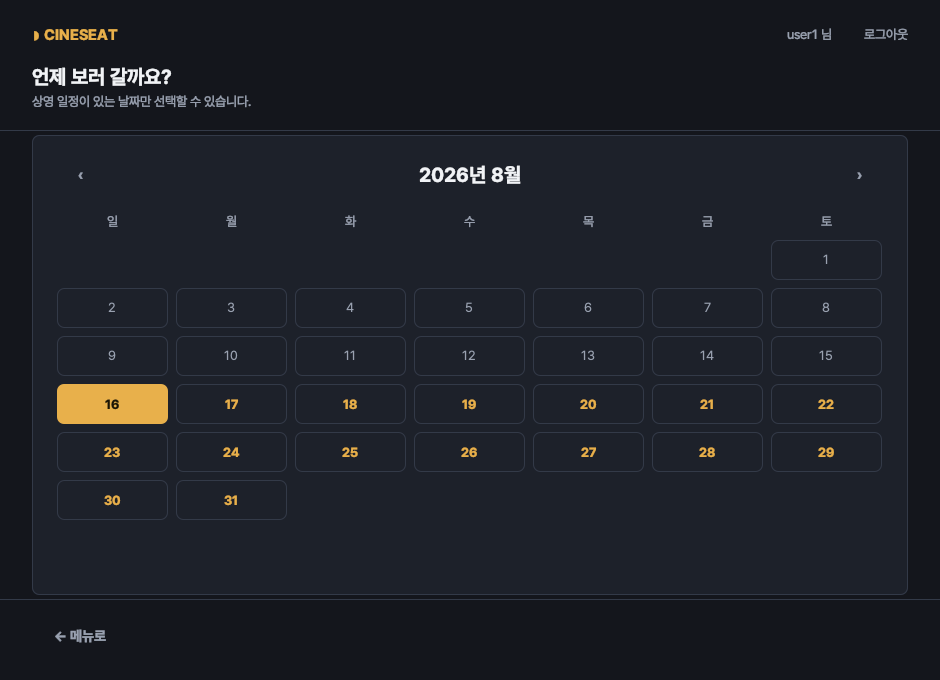
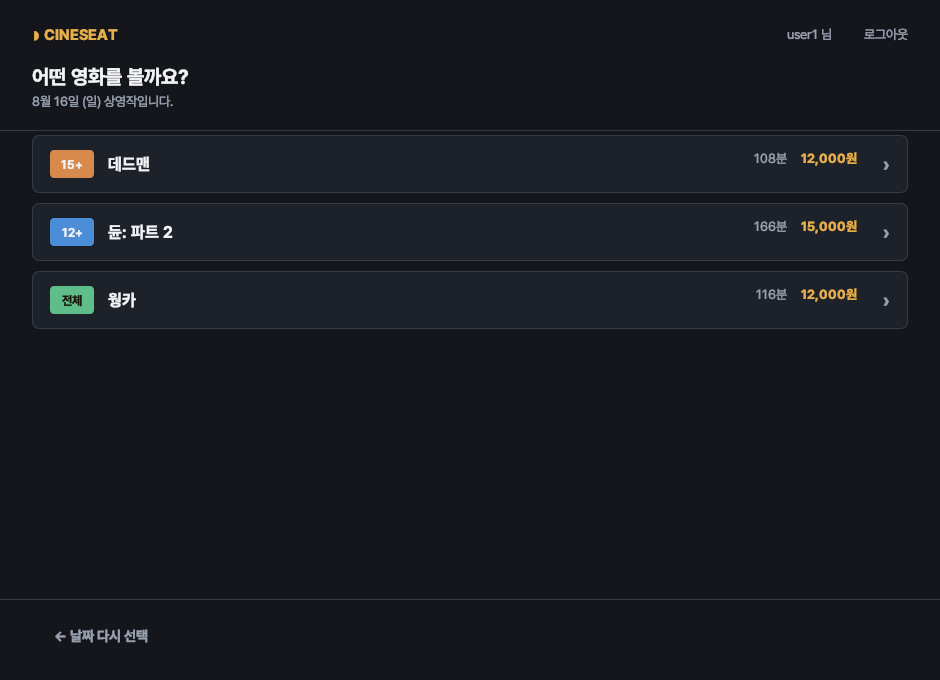
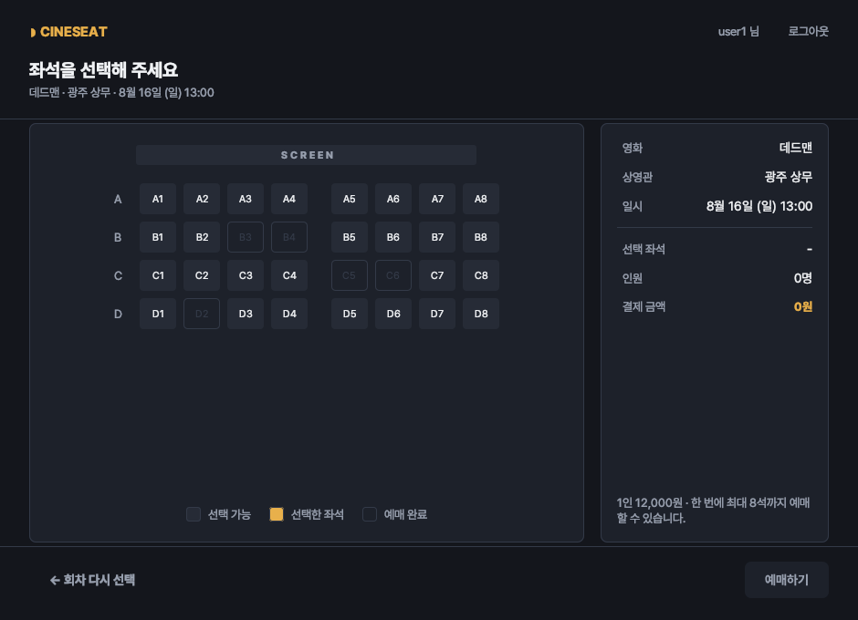
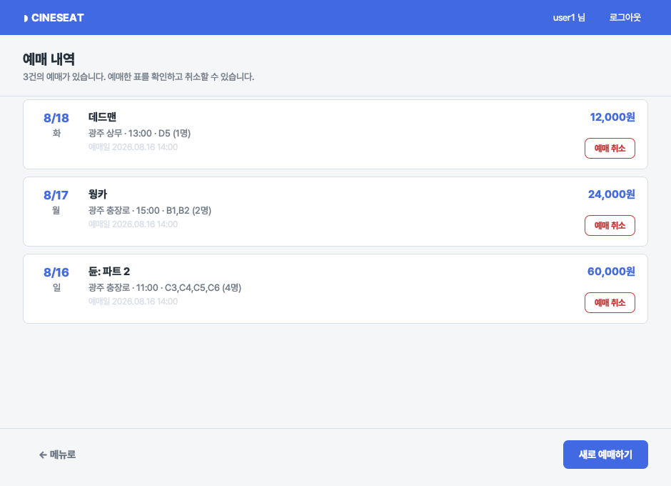
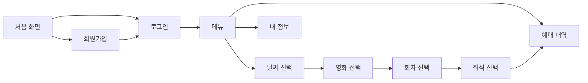
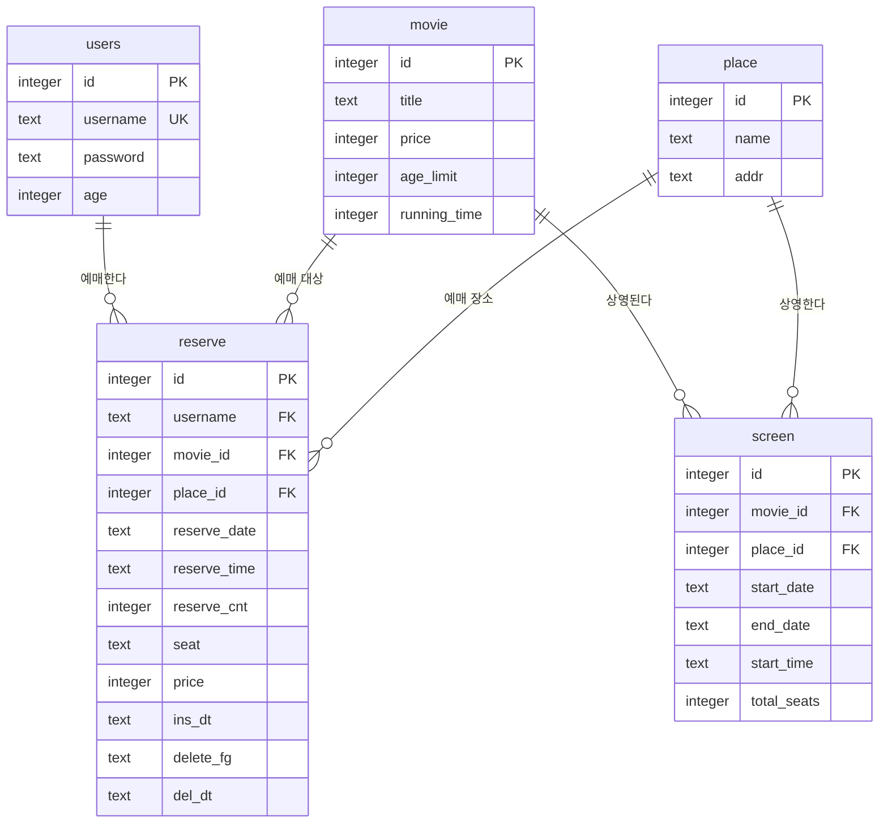

# CineSeat

Java Swing 과 SQLite 로 만든 영화 좌석 예매 데스크톱 애플리케이션입니다.
날짜를 고르고 회차를 정한 다음 좌석을 누르면 예매가 끝납니다.

> 백엔드 미니 프로젝트로 만든 좌석 예매 서비스를 UI · 기능 · 구조 면에서 정리한 저장소입니다.
> 무엇을 어떻게 바꿨는지는 [정리하면서 고친 것](#-정리하면서-고친-것)에 적어 두었습니다.

<table>
  <tr>
    <td width="50%"></td>
    <td width="50%"></td>
  </tr>
  <tr>
    <td></td>
    <td></td>
  </tr>
</table>

## 🎬 기능

| 기능 | 설명 |
| --- | --- |
| 회원가입 · 로그인 | 아이디 중복, 비밀번호 확인, 나이 범위를 입력하는 즉시 검사합니다. |
| 날짜 선택 | 상영 일정이 실제로 있는 날짜만 달력에서 켜집니다. 지난 날짜는 고를 수 없습니다. |
| 영화 선택 | 고른 날짜의 상영작을 관람 등급 · 상영 시간 · 가격과 함께 보여 줍니다. |
| 회차 선택 | 상영관별 시간대와 잔여 좌석을 보여 주고, 매진된 회차는 선택되지 않습니다. |
| 좌석 선택 | 이미 팔린 좌석은 누를 수 없고, 고른 좌석 수에 따라 금액이 바로 계산됩니다. |
| 예매 · 취소 | 예매 내역에서 표를 확인하고 그 자리에서 취소할 수 있습니다. |
| 내 정보 | 계정 정보와 예매 건수 · 좌석 수 · 결제 금액을 함께 보여 줍니다. |

## 🧭 화면 흐름



창을 여러 개 띄우지 않고 하나의 창에서 화면만 바꿉니다. 뒤로 가기는 모든 화면 왼쪽 아래에
같은 자리로 놓여 있습니다.

## 🗂 데이터 모델



- `screen` 한 행은 **한 기간 동안 매일 같은 시각에 하는 한 회차**를 뜻합니다.
  시간대를 `11:00|14:00|17:00` 처럼 한 칸에 몰아 넣지 않기 때문에 회차를 그대로 조회할 수 있습니다.
- `reserve` 는 취소해도 행을 지우지 않고 `delete_fg` 를 `Y` 로 바꿉니다. 취소 이력이 남습니다.
- 좌석은 `A1,A2` 처럼 저장하고, 같은 회차에 이미 팔린 좌석과 겹치는지 확인한 뒤 저장합니다.
- SQLite 에는 날짜/시각 전용 타입이 없어 `2026-08-16`, `14:30:00` 형식의 문자열로 저장합니다.
  이 형식이면 문자열 비교만으로 순서와 범위 비교가 정확히 맞아떨어집니다.

## 🚀 실행 방법

**필요한 것** — JDK 17 이상. 그게 전부입니다.

```bash
./run.sh
```

데이터베이스는 SQLite 파일 하나(`db/cineseat.db`)라서 서버를 띄우거나 계정을 만들 필요가 없습니다.
`run.sh` 가 처음 실행될 때 아래를 알아서 처리합니다.

1. SQLite JDBC 드라이버를 `lib/` 에 내려받습니다.
2. 소스를 컴파일합니다.
3. `db/schema.sql` 로 데이터베이스와 예시 데이터를 만듭니다.
   (상영 일정은 실행한 날짜를 기준으로 생성되므로 언제 실행해도 예매할 수 있습니다.)

```bash
./run.sh --reset   # 데이터베이스를 지우고 예시 데이터로 다시 만든 뒤 실행
./run.sh --clean   # 컴파일 결과를 지우고 처음부터 빌드
```

예시 계정은 `user1 / test1234`, `test / test1234` 입니다.

데이터베이스 파일 위치를 바꾸려면 `config/config.properties` 의 `db.url` 이나
환경 변수 `CINESEAT_DB_URL` 을 쓰면 됩니다. 설정하지 않으면 `db/cineseat.db` 를 씁니다.

> IntelliJ 에서 실행할 때는 `src` 를 소스 루트로 지정하고, `lib/` 의 JAR 을 모듈 라이브러리로
> 추가한 다음 `com.cineseat.CineSeatApp` 을 실행하면 됩니다. 작업 디렉터리는 저장소 루트여야
> `db/`, `assets/` 를 찾을 수 있습니다. (`./run.sh` 를 한 번 돌려 두면 드라이버와 데이터베이스가
> 준비됩니다.)

## 🎞 실제 상영작으로 데이터 채우기

`db/schema.sql` 의 예시 영화 대신, 실제로 상영 중인 영화를 넣을 수 있습니다.
[KOBIS(영화진흥위원회) 오픈 API](https://www.kobis.or.kr/kobisopenapi/) 에서 일별 박스오피스와
영화 상세 정보를 받아 시드 SQL 을 만들어 주는 도구가 있습니다.

```bash
# 키 없이 — 공개 박스오피스 페이지에서 실제 상영작 제목을 가져옵니다.
java tools/SeedMovies.java

# 키가 있으면 — 상영시간과 관람등급까지 정확히 받아 옵니다. (권장)
java tools/SeedMovies.java --key=발급받은키

# 옵션: 기준일, 가져올 편수, 출력 경로
java tools/SeedMovies.java --date=20260815 --count=8 --out=db/seed-movies.sql

# 만들어진 SQL 적용
sqlite3 db/cineseat.db < db/seed-movies.sql
```

| | 키 없이 | 키 사용 (`--key=`) |
| --- | --- | --- |
| 영화 제목 | ✅ 실제 상영작 | ✅ 실제 상영작 |
| 상영시간 | ⚠️ 110분 고정 | ✅ 실제 값 |
| 관람등급 | ⚠️ 전체관람가 고정 | ✅ 실제 값 |

- 키 없는 방식은 공개 페이지의 HTML 을 읽기 때문에 **KOBIS 가 페이지 구조를 바꾸면 깨질 수
  있습니다.** 그때는 오류 메시지로 알려 주며, 키를 발급받아 API 를 쓰는 쪽이 안정적입니다.
- **가격은 어느 쪽에서도 주지 않으므로** 상영시간 150분 이상이면 15,000원,
  그 외에는 12,000원으로 정합니다.
- 상영관과 회차는 실제 극장 시간표가 아니라 이 프로젝트의 상영관 3곳에 맞춰 생성합니다.
  순위가 높은 영화일수록 더 많은 상영관에 더 오래 걸립니다.
- 앱은 이 도구를 쓰지 않습니다. 데이터를 한 번 받아 SQL 로 떨궈 두는 방식이라
  애플리케이션에는 네트워크나 JSON 의존성이 생기지 않고 오프라인에서도 그대로 동작합니다.

> ⚠️ 생성된 SQL 은 영화 · 상영일정 · **예매 데이터를 모두 지우고** 새로 넣습니다.
> 남겨야 할 예매 내역이 있다면 먼저 백업해 주세요.

## 📁 프로젝트 구조

```
src/com/cineseat/
├── CineSeatApp.java        진입점. 룩앤필 적용과 DB 연결 확인
├── db/
│   ├── Database.java       설정 로딩과 커넥션 생성
│   ├── SqlValues.java      날짜·시각 ↔ 문자열 변환
│   ├── SqlErrors.java      제약 위반 판별
│   └── DataAccessException.java
├── model/                  User · Movie · Screening · Reservation (record)
├── dao/                    UserDao · MovieDao · ScreeningDao · ReservationDao
└── ui/
    ├── Theme.java          색 · 서체 · 공통 컴포넌트
    ├── AppFrame.java       창 하나를 유지하며 화면을 교체
    ├── View.java           모든 화면이 공유하는 머리말 · 본문 · 꼬리말 뼈대
    ├── RowCard.java        목록 한 줄
    ├── Dialogs.java        알림 · 확인 대화 상자
    └── view/               화면 10개

db/schema.sql               테이블과 예시 데이터 (SQLite)
config/                     데이터베이스 위치 설정 (선택)
assets/                     앱 아이콘
tools/SeedMovies.java       KOBIS 에서 실제 상영작 시드 SQL 생성
tools/InitDb.java           SQL 파일로 데이터베이스 생성
run.sh                      컴파일 후 실행
```

화면은 색을 직접 지정하지 않고 `Theme` 만 사용합니다. 어느 화면에 들어가도 여백과 색이 같은
이유입니다. DAO 는 화면을 모르고, 화면은 SQL 을 모릅니다.

## 🔧 정리하면서 고친 것

미니 프로젝트로 만든 원본을 옮기면서 눈에 띈 문제들을 함께 정리했습니다.

**기능**

| 문제 | 어떻게 바꿨는지 |
| --- | --- |
| 상영관을 고를 때 `screen.id` 를 `place_id` 로 넘겨 외래키 제약에 걸림 | 조회 시 `place.id` 를 함께 읽어 정확한 값을 넘김 |
| 예매하면 선택한 상영일 · 시각이 아니라 예매를 누른 순간의 날짜 · 시각이 저장됨 | 고른 회차의 날짜와 시각을 그대로 저장 |
| 좌석 중복 확인이 없어 같은 좌석을 여러 번 예매할 수 있었음 | 같은 트랜잭션 안에서 좌석을 확인한 뒤 저장하고, 겹치면 어떤 좌석인지 알려 줌 |
| 좌석 가격이 10,000원으로 고정 | 영화별 가격으로 계산 |
| 예매 가능한 날짜가 소스 코드에 하드코딩 | `screen` 테이블에서 조회 |
| 예매 인원과 좌석 수를 따로 입력받아 서로 어긋남 | 고른 좌석 수가 곧 인원이 되도록 정리 |
| 예매 상세 화면이 영화 제목 대신 `movie_id` 를 표시 | 조회할 때 영화 제목과 상영관 이름을 함께 읽어 옴 |
| 예매 취소에 소유자 확인이 없었음 | 본인 예매만 취소되도록 조건 추가 |
| 빈 껍데기였던 결제 화면이 닫히면 앱 전체가 종료됨 | 화면을 없애고 메뉴를 실제 기능 세 가지로 정리 |

**구조**

| 문제 | 어떻게 바꿨는지 |
| --- | --- |
| DB 비밀번호를 콘솔에 그대로 출력 | 출력 제거, 환경 변수로도 설정 가능하도록 변경 |
| 공용 static 커넥션 하나를 화면마다 닫아 버림 | 필요할 때 열고 `try-with-resources` 로 닫도록 변경 |
| 로그인한 사용자 대신 DB 계정 이름을 사용자로 착각해 사용 | 로그인 정보를 `AppFrame` 한 곳에서 관리 |
| SQL 예외를 `printStackTrace` 로만 남기고 화면은 조용히 실패 | `DataAccessException` 으로 감싸 화면에 원인을 표시 |
| 화면마다 새 `JFrame` 을 띄워 창이 쌓임 | 창 하나에서 화면만 교체 |
| 화면마다 색 · 여백 · 글꼴을 따로 지정 | `Theme` 와 `View` 로 공통화 |
| 디버깅용 `System.out.println` 이 곳곳에 남아 있음 | 모두 제거 |
| MySQL 서버와 계정이 있어야만 실행할 수 있었음 | SQLite 파일 하나로 바꿔 `./run.sh` 만으로 실행되도록 변경 |

**UI**

- 원본이 쓰던 밝은 배경과 로열 블루를 유지하되, 화면마다 제각각이던 여백과 색을 하나로 맞췄습니다.
- 좌석은 스크린 위치 · 통로 · 행 번호를 그려 실제 상영관처럼 보이도록 했습니다.
- 선택 가능 / 선택한 좌석 / 예매 완료를 색과 범례로 구분했습니다.
- 입력 오류는 대화 상자 대신 입력 칸 아래에 바로 표시합니다.
- 예매 내역은 표 한 줄에 영화 · 상영관 · 시각 · 좌석 · 금액을 모두 보여 주고, 그 자리에서 취소합니다.

## 📝 되돌아보며

처음 이 프로젝트를 만들 때는 "완성부터 시키자"는 마음이 앞서서 설계를 하면서 구현했습니다.
그래서 코드가 늘어날수록 어디서 어떤 문제가 생기는지 구분하기 어려워졌습니다.

특히 좌석을 예매할 때 참조 테이블에 없는 값을 넣어 생긴 외래키 오류를 오래 붙잡고 있었습니다.

```
java.sql.SQLIntegrityConstraintViolationException: Cannot add or update a child row:
a foreign key constraint fails (`moviedb`.`reserve`,
CONSTRAINT `reserve_ibfk_3` FOREIGN KEY (`place_id`) REFERENCES `place` (`id`))
```

당시에는 값을 넣기 전에 유효성 검사를 추가하는 방식으로 넘어갔지만, 이번에 다시 보니
원인은 따로 있었습니다. 상영관 목록을 조회할 때 `screen.id` 를 `place_id` 자리에 넘기고
있었던 것입니다. 검사를 덧붙이는 대신 잘못된 값이 애초에 흘러가지 않도록 조회 쿼리에서
`place.id` 를 함께 읽도록 바꿨습니다.

에러 메시지를 그대로 막는 것과, 그 값이 어디서 왔는지 따라가 보는 것은 다른 일이라는 걸
이번 정리에서 배웠습니다.
